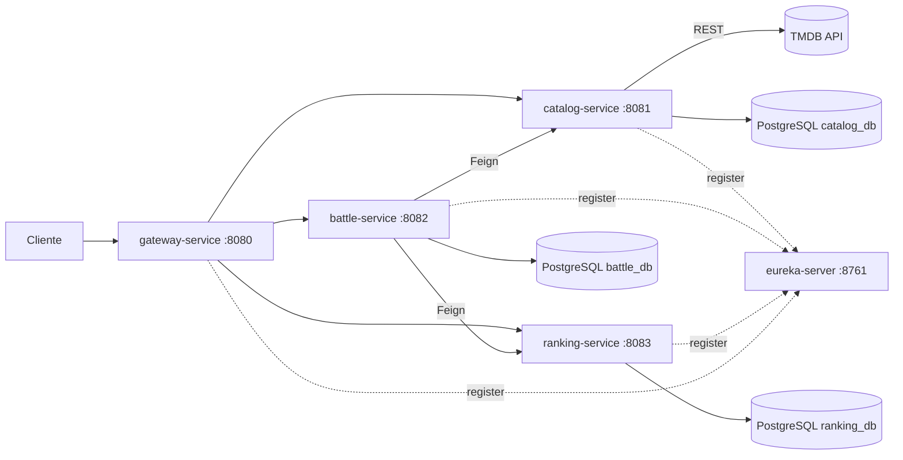
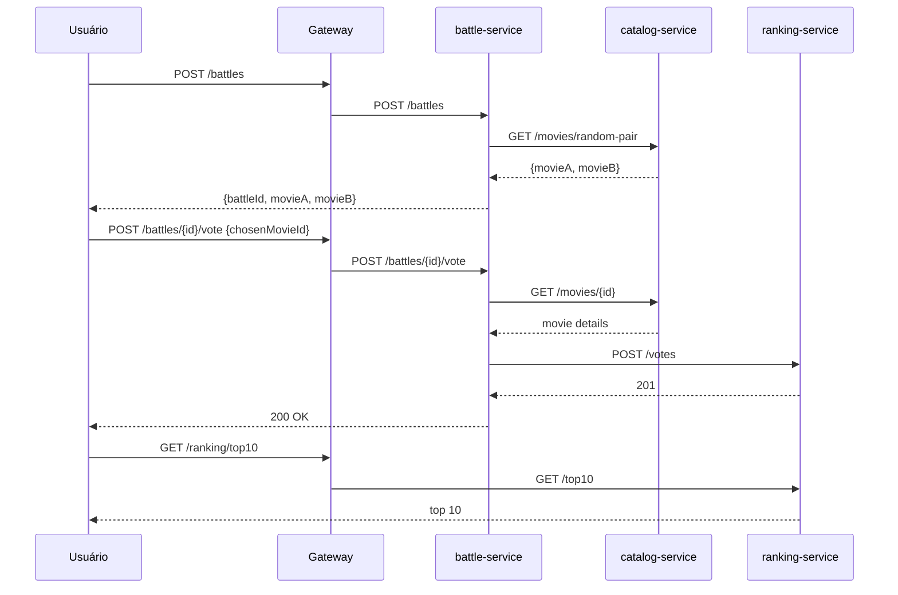
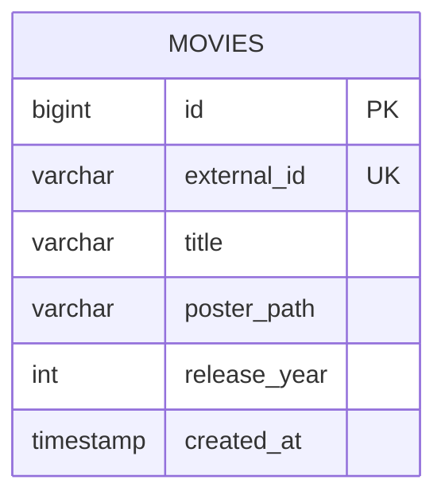
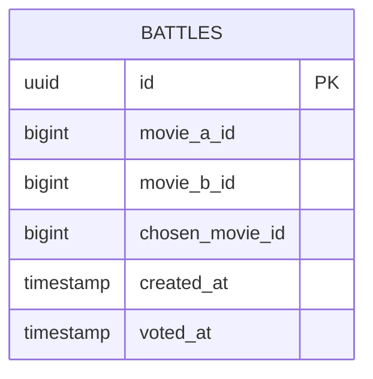
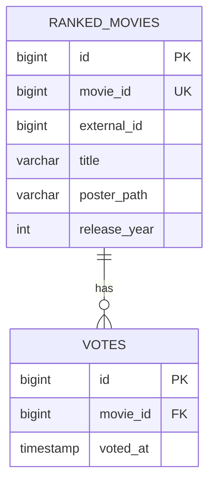

# Diagramas

## Arquitetura de microsserviços

```mermaid
flowchart LR
    Client[Cliente] --> GW[gateway-service :8080]
    GW --> CS[catalog-service :8081]
    GW --> BS[battle-service :8082]
    GW --> RS[ranking-service :8083]

    BS -- Feign --> CS
    BS -- Feign --> RS
    CS -- REST --> TMDB[(TMDB API)]
    CS --> CDB[(PostgreSQL catalog_db)]
    BS --> BDB[(PostgreSQL battle_db)]
    RS --> RDB[(PostgreSQL ranking_db)]

    CS -. register .-> EU[eureka-server :8761]
    BS -. register .-> EU
    RS -. register .-> EU
    GW -. register .-> EU
```

## Sequência — batalha completa

```mermaid
sequenceDiagram
    participant U as Usuário
    participant GW as Gateway
    participant BS as battle-service
    participant CS as catalog-service
    participant RS as ranking-service
    U->>GW: POST /battles
    GW->>BS: POST /battles
    BS->>CS: GET /movies/random-pair
    CS-->>BS: {movieA, movieB}
    BS-->>U: {battleId, movieA, movieB}
    U->>GW: POST /battles/{id}/vote {chosenMovieId}
    GW->>BS: POST /battles/{id}/vote
    BS->>CS: GET /movies/{id}
    CS-->>BS: movie details
    BS->>RS: POST /votes
    RS-->>BS: 201
    BS-->>U: 200 OK
    U->>GW: GET /ranking/top10
    GW->>RS: GET /top10
    RS-->>U: top 10
```

## ER — catalog_db

```mermaid
erDiagram
    MOVIES {
        bigint id PK
        varchar external_id UK
        varchar title
        varchar poster_path
        int release_year
        timestamp created_at
    }
```

## ER — battle_db

```mermaid
erDiagram
    BATTLES {
        uuid id PK
        bigint movie_a_id
        bigint movie_b_id
        bigint chosen_movie_id
        timestamp created_at
        timestamp voted_at
    }
```

## ER — ranking_db

```mermaid
erDiagram
    RANKED_MOVIES {
        bigint id PK
        bigint movie_id UK
        bigint external_id
        varchar title
        varchar poster_path
        int release_year
    }
    VOTES {
        bigint id PK
        bigint movie_id FK
        timestamp voted_at
    }
    RANKED_MOVIES ||--o{ VOTES : "has"
```
